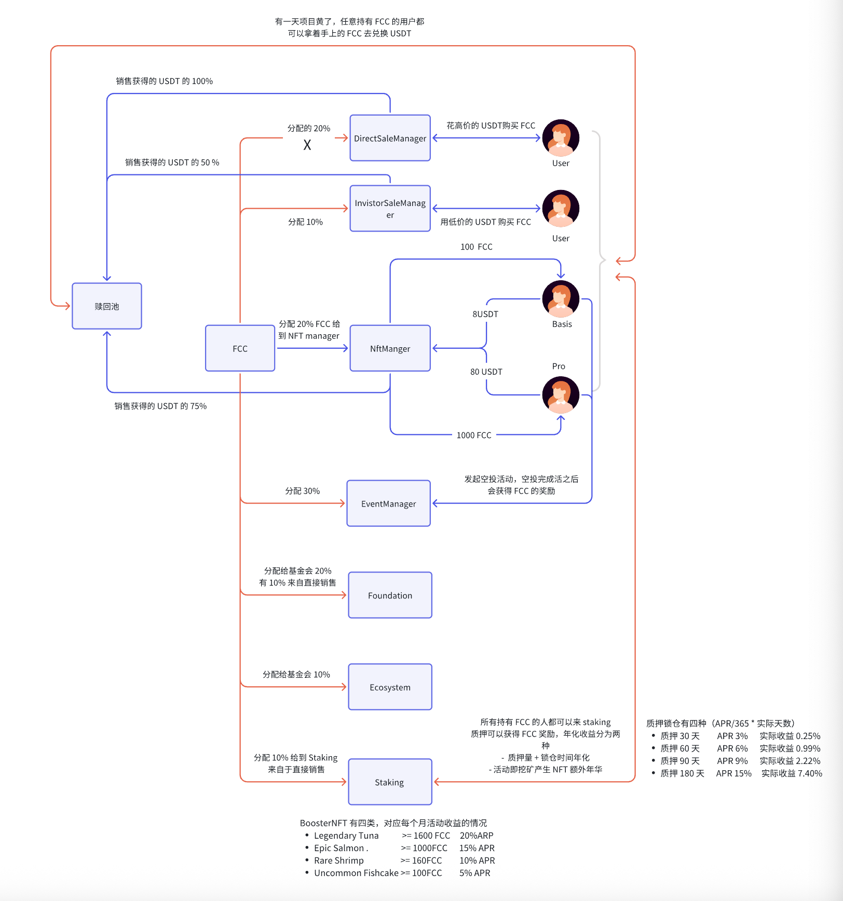

# FishCake Contracts

FishCake 是一个创新的 Web3 项目,通过 NFT、质押和活动空投机制,将线下商家活动与区块链经济相结合。

## 项目概述

FishCake 生态系统包含以下核心功能:

- **代币销售**: 用户可通过 USDT 购买 FCC 代币
- **NFT 系统**: 支持 Basic NFT (8 USDT) 和 Pro NFT (80 USDT),用于获得挖矿和活动收益
- **质押挖矿**: 用户可质押 FCC 获得 APR 收益,Booster NFT 可提供额外加成
- **活动空投**: 商家可发起空投活动,参与者获得 FCC 奖励
- **赎回机制**: 项目结束后用户可用 FCC 按比例赎回 USDT

## 业务流程架构



### FCC 代币分配

总发行量 **10 亿 FCC**,分配如下:

1. **销售部分 (70%)**:

   - **DirectSaleManager (20%)**: 直接销售,100% USDT 进入赎回池
   - **InvestorSaleManager (10%)**: 投资者销售,50% USDT 进入赎回池,50% 留在合约

2. **NFT Manager (20%)**: 用户购买 NFT 时获得 FCC 返还

   - Basic NFT: 返还 100 FCC
   - Pro NFT: 返还 1,000 FCC

3. **EventManager (30%)**: 活动空投挖矿池,商家发起活动可获得挖矿奖励

4. **Foundation (20%)**: 基金会份额,10% 直接释放

5. **Ecosystem (10%)**: 生态系统份额

6. **Staking (10%)**: 质押奖励池

### 核心合约交互

```
用户 ─► DirectSaleManager ──► 赎回池 (100% USDT)
      │                       │
      └► InvestorSaleManager ─┤ (50% USDT)
                              │
用户 ─► NftManager ───────────┤ (75% USDT)
      │                       │
      ├► Basic NFT (8 USDT)   │
      └► Pro NFT (80 USDT)    │
      │                       ▼
      └─► 获得 100/1000 FCC  赎回池
                              ▲
用户 ─► EventManager          │
      └► 空投活动/挖矿       │
                              │
用户 ─► Staking ──────────────┘
      └► 质押挖矿 + Booster NFT
```

## 开发工具链

本项目使用 **Foundry** 作为智能合约开发框架。

Foundry 包含以下工具:

- **Forge**: 以太坊测试框架
- **Cast**: 智能合约交互的瑞士军刀
- **Anvil**: 本地以太坊节点
- **Chisel**: Solidity REPL

### 文档

https://book.getfoundry.sh/

## 核心合约说明

### 1. DirectSalePool (直接销售池)

- **价格**: 1 USDT = 10 FCC
- **USDT 流向**: 100% 进入赎回池
- **用途**: 面向普通用户的直接购买渠道

### 2. InvestorSalePool (投资者销售池)

- **价格**: 根据当前池子状态动态计算
- **USDT 流向**: 50% 进入赎回池,50% 留在合约
- **用途**: 面向投资者的购买渠道

### 3. NftManager (NFT 管理器)

管理两种类型的 NFT:

#### 会员 NFT

- **Basic NFT**: 8 USDT,返还 100 FCC,有效期 30 天
- **Pro NFT**: 80 USDT,返还 1,000 FCC,有效期 30 天
- **USDT 流向**: 75% 进入赎回池,20% 给 NFT Manager,5% 其他用途

#### Booster NFT (质押加成 NFT)

用于质押时提供额外 APR 加成,一次性使用:

- **Legendary Tuna**: >= 1600 FCC,20% APR 加成
- **Epic Salmon**: >= 1000 FCC,15% APR 加成
- **Rare Shrimp**: >= 160 FCC,10% APR 加成
- **Uncommon Fishcake**: >= 100 FCC,5% APR 加成

### 4. EventManager (活动管理器)

- **功能**: 商家可发起空投活动,用户参与领取奖励
- **挖矿机制**: 商家发起活动结束后,可获得挖矿奖励 (需持有 NFT)
- **奖励池**: 30% FCC 总量用于活动挖矿
- **挖矿递减**:
  - < 3000 万: 50% 奖励
  - < 1 亿: 40% 奖励
  - < 2 亿: 20% 奖励
  - < 3 亿: 10% 奖励

### 5. StakingManager (质押管理器)

用户质押 FCC 获得固定 APR 收益:

| 锁定期 | 基础 APR | 实际收益率(含 Booster) |
| ------ | -------- | ---------------------- |
| 30 天  | 3%       | 实际收益 0.25%         |
| 60 天  | 6%       | 实际收益 0.99%         |
| 90 天  | 9%       | 实际收益 2.22%         |
| 180 天 | 15%      | 实际收益 7.40%         |

- **Booster NFT 加成**: 质押时可绑定 Booster NFT 获得额外 5%-20% APR
- **APR 减半**: 2025-10-31 后所有 APR 减半
- **最小质押**: 10 FCC
- **奖励池**: 10% FCC 总量用于质押奖励

### 6. RedemptionPool (赎回池)

- **锁定期**: 1095 天 (约 3 年)
- **赎回机制**: 用户销毁 FCC,按比例获得池中 USDT
- **计算公式**: 赎回 USDT = (池中 USDT 总量 × 销毁 FCC 数量) / FCC 总供应量

## 快速开始

### 安装依赖

```bash
# 安装 Foundry (如果尚未安装)
curl -L https://foundry.paradigm.xyz | bash
foundryup

# 安装项目依赖
forge install
```

### 编译合约

```bash
forge build
```

### 运行测试

```bash
# 运行所有测试
forge test

# 运行特定测试并显示详细输出
forge test --match-path test/YourTest.t.sol -vvv

# 生成 Gas 报告
forge test --gas-report
```

### 代码格式化

```bash
forge fmt
```

### 本地开发

```bash
# 启动本地节点
anvil

# 部署合约 (在另一个终端)
forge script script/Deploy.s.sol --rpc-url http://localhost:8545 --private-key <your_private_key> --broadcast
```

## 项目结构

```
FishCake-contracts/
├── src/
│   └── contracts/
│       ├── core/
│       │   ├── FishCakeEventManager.sol    # 活动管理
│       │   ├── StakingManager.sol          # 质押管理
│       │   ├── RedemptionPool.sol          # 赎回池
│       │   ├── sale/
│       │   │   ├── DirectSalePool.sol      # 直接销售
│       │   │   └── InvestorSalePool.sol    # 投资者销售
│       │   └── token/
│       │       ├── FishCakeCoin.sol        # FCC 代币
│       │       └── NftManagerV5.sol        # NFT 管理
│       └── interfaces/                     # 合约接口
├── test/                                   # 测试文件
├── lib/                                    # 依赖库
├── foundry.toml                            # Foundry 配置
└── remappings.txt                          # Import 路径映射
```

## 技术特性

- ✅ 使用 OpenZeppelin 可升级合约模式
- ✅ 完整的重入攻击防护 (ReentrancyGuard)
- ✅ SafeERC20 安全代币转账
- ✅ 基于时间锁的质押和赎回机制
- ✅ 动态 APR 和挖矿奖励递减机制
- ✅ NFT 会员系统和 Booster 加成系统
